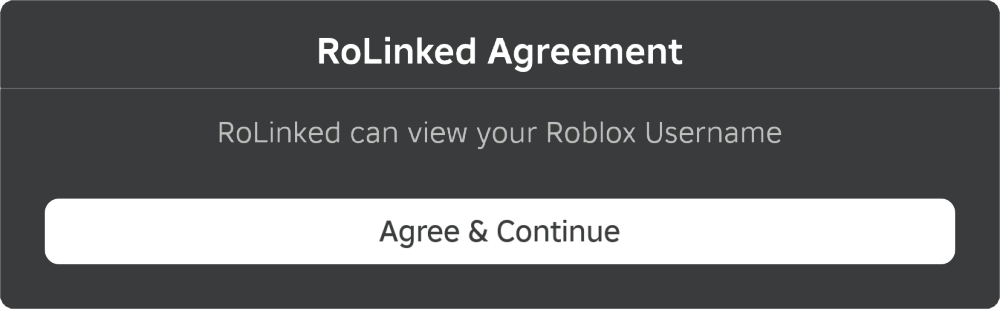

[Back to main](./README.md)

# Analysis

## Website

Looking at RDAP record for https://rolinked.com we can see that the domain name is registered through [PSI-USA](https://www.psi-usa.info/), a domain registrar based in Las Vegas.

We can also see from the technical contact that is hosted by Hosterbox, this is backed up by the nameservers `ns70.hosterbox.com` and `ns71.hosterbox.com`. Furthermore on 2024-07-22 the website returned a page informing that the account had been suspended and to contact the hosting provider, which links to [HosterBox](https://hosterbox.com/).

On 2024-08-04 the website was operational again. The technical and administrative RDAP records show [HosterBox](https://hosterbox.com/).

Looking on [VirusTotal](https://www.virustotal.com/graph/rolinked.com) we can see that the domain was registered through [Hostinger](http://www.hostinger.com) on 2024-04-15 and on 2024-05-18 was registered through [PSI-USA](https://www.psi-usa.info/).

Along with [HosterBox](https://hosterbox.com/) it has also been associated with [Hostinger](http://www.hostinger.com), and [ServerMania](https://www.servermania.com/), which are both hosting companies. It has also been protected with [Cloudflare](https://www.cloudflare.com/), and [Verdina](https://verdina.net/).

## Code

From the deobfuscated code I have created this flowchart which outlines how it works.

If conditional statements are missing a `True` or `False` then that path would result in the script stopping.

## Friend Request

When the friend request is sent it is sent to the Roblox account id `6045232974`. This account can be found at https://www.roblox.com/users/6045232974/profile, which shows they are called `slimeBallBack7`. Their account appears like this:

This has been the user friended since 2024-06-08. Before that it was the Roblox account id `5762605139`, which has since been terminated.

## Email

This table contains the emails stored in the code that are used to take control of the account. They are all either @hotmail.com or @outlook.com.

| Date       | Emails                                                                                                                                                                                                                                                            |
| ---------- | ----------------------------------------------------------------------------------------------------------------------------------------------------------------------------------------------------------------------------------------------------------------- |
| 2024-05-20 | carolinazf8w@outlook.com                                                                                                                                                                                                                                          |
| 2024-06-08 | mendcarl3@hotmail.com                                                                                                                                                                                                                                             |
| 2024-06-20 | parente.ilda@hotmail.com                                                                                                                                                                                                                                          |
| 2024-06-27 | katiemacadam26@hotmail.com kendalmonica13@hotmail.com                                                                                                                                                                                                          |
| 2024-07-03 | teresafarmer46@outlook.com                                                                                                                                                                                                                                        |
| 2024-07-07 | dowmanmelissa83@hotmail.com                                                                                                                                                                                                                                       |
| 2024-07-15 | albertinaguerrero1971@hotmail.com alwine.lenora_1989@hotmail.com  archibaldalexandra64@hotmail.com  aldridgeangela13@hotmail.com anitabaldwin50@hotmail.com alicebirch40@hotmail.com archibaldmary94@hotmail.com alyssagilmore09@hotmail.com |
| 2024-08-04 | goickgnerreb@outlook.com gruettfick0@outlook.com geistbezakr@outlook.com graciamascios@outlook.com                                                                                                                                                       |

## Popups

The script makes heavy use of popups to present it as reputable, and for some popups, such as the fake 2FA/OTP popups to present itself as Roblox.

### Not Logged In

### Error in Getting Collectables

### Unable to be Linked

### Agreement

### Pin Locked

### Enable Email 2FA

### Fake 2FA/OTP

