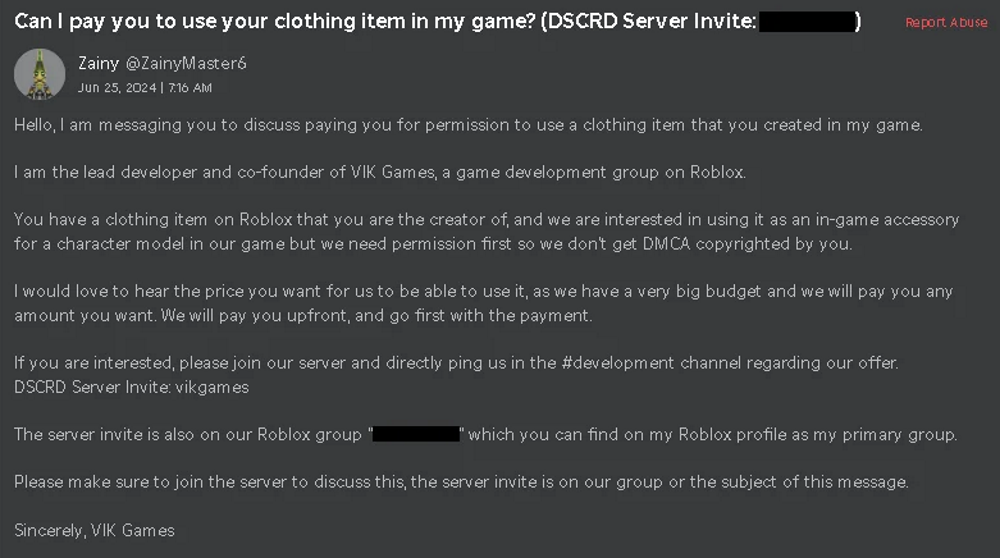
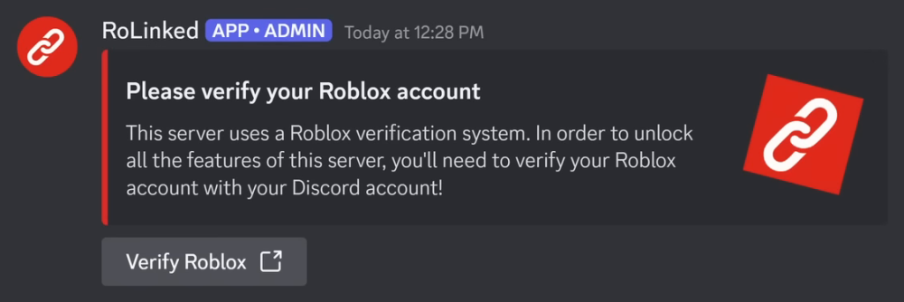
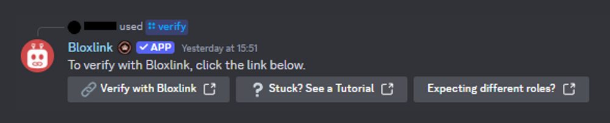
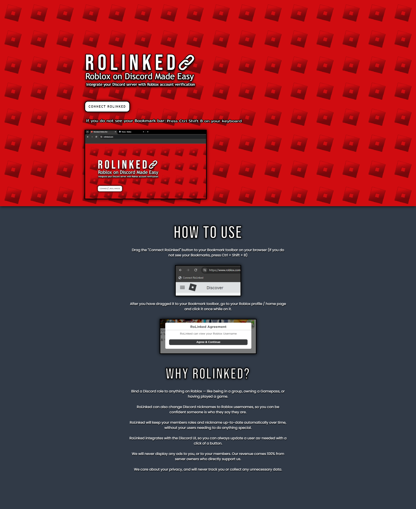

[Back to main](./README.md)

# Distribution

## Target Audience

Due to the nature of Roblox this targets young, and inexperienced users who may be more susceptible to falling victim to the account stealer.

However this account stealer in specific targets Roblox Developers and users who have large amount of, or high value collectables. This appears to be so that they can be sold after gaining access to the account.

## Methods

The account stealer appears to be spread though Roblox DMs with messages such as:

_Credit to [/u/AlternativeAnarchy](https://www.reddit.com/user/AlternativeAnarchy/)_ for the screenshot.

These messages offer the opportunity for payment, either for use of clothing items, or purchasing games. These messages then tell the user to join a Discord server. Links to this Discord server are provided on group pages and game pages as social links. I have found two Roblox groups associated with this account stealer, namely, [Motive Creations](https://www.roblox.com/groups/34125328/Motive-Creations#!/about), and [VlK Games](https://www.roblox.com/groups/34265071/VlK-Games#!/about).

Upon joining the Discord server there will usually be a verification channel which contains the message below:

_Credit to [No Text To Speech](https://www.youtube.com/@NoTextToSpeech)_ for the screenshot.

This is designed to impersonate similar looking messages from genuine bots designed to link Roblox and Discord accounts, such as BloxLink.

When you click `Verify Roblox` it takes you to https://rolinked.com.

## Website

The website included simple instructions on how to show the bookmarks bar, drag the script into it, and then execute it on Roblox.

Looking at RDAP record for https://rolinked.com we can see that the domain name is registered through [PSI-USA](https://www.psi-usa.info/), a domain registrar based in Las Vegas.

We can also see from the technical contact that is hosted by Hosterbox, this is backed up by the nameservers `ns70.hosterbox.com` and `ns71.hosterbox.com`. Furthermore on 2024-07-22 the website returned a page informing that the account had been suspended and to contact the hosting provider, which links to https://hosterbox.com/.

